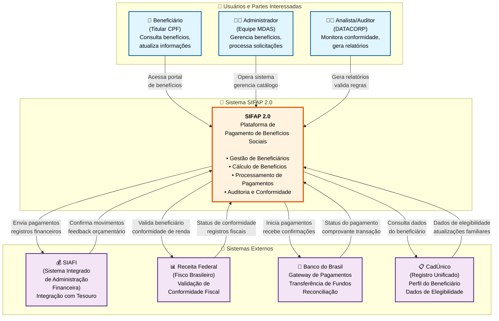

# Diagrama C4 Nível 1 - Arquitetura do SIFAP 2.0

> Diagrama de contexto do sistema mostrando o SIFAP 2.0 e suas interações com sistemas externos e tipos de usuários.

## Visão Geral

Este diagrama C4 Nível 1 (Contexto do Sistema) apresenta o sistema SIFAP 2.0 em alto nível, incluindo:

- **3 Tipos de Usuários** interagindo com o sistema
- **Sistema Central** (SIFAP 2.0)
- **4 Sistemas Externos** para troca de dados e conformidade

## Diagrama C4 Nível 1

## Componentes do Diagrama

### Tipos de Usuários (3)

| Tipo de Usuário      | Papel                                         | Atividades Principais                                                                               | 
|----------------------|-----------------------------------------------|-----------------------------------------------------------------------------------------------------| 
| **Beneficiário**     | Titular de CPF / Receptor de benefício social | • Consultar benefícios pessoais• Atualizar informações pessoais• Visualizar histórico de pagamentos | 
| **Administrador**    | Equipe MDAS / Operador do sistema             | • Gerenciar programas de benefícios• Processar solicitações• Configurar regras do sistema           | 
| **Analista/Auditor** | Especialista DATACORP                         | • Monitorar conformidade do sistema• Gerar relatórios de auditoria• Validar regras de negócio       | 

### Sistema Central

**SIFAP 2.0** - Plataforma de Pagamento de Benefícios Sociais

- Gestão de Beneficiários (registro, perfil, status)
- Cálculo de Benefícios (valores, elegibilidade)
- Processamento de Pagamentos (agendamento, confirmação)
- Auditoria e Conformidade (validação de regras, registros)

### Sistemas Externos (4)

| Sistema             | Propósito                           | Fluxo de Dados                                                        | 
|---------------------|-------------------------------------|-----------------------------------------------------------------------| 
| **SIAFI**           | Integração com tesouro              | Envia registros financeiros → Recebe feedback orçamentário            | 
| **Receita Federal** | Conformidade fiscal                 | Valida CPF/renda → Retorna status de conformidade                     | 
| **Banco do Brasil** | Gateway de pagamentos               | Inicia pagamentos → Recebe confirmações                               | 
| **CadÚnico**        | Registro unificado de beneficiários | Consulta dados de beneficiário → Recebe atualizações de elegibilidade | 

## Pontos-chave de Integração

### Entrada (Dos Sistemas Externos)
1. **CadÚnico** → Dados de elegibilidade do beneficiário e composição familiar
2. **Receita Federal** → Status de conformidade fiscal e verificação de renda
3. **Banco do Brasil** → Confirmação de pagamento e reconciliação
4. **SIAFI** → Alocação orçamentária e feedback do tesouro

### Saída (Para Sistemas Externos)
1. **SIAFI** → Registros financeiros e movimentações de pagamentos
2. **Receita Federal** → Dados de renda do beneficiário para validação
3. **Banco do Brasil** → Requisições de iniciação de pagamentos
4. **CadÚnico** → Consultas de elegibilidade de benefícios

## Fundamentação da Arquitetura

Este diagrama C4 Nível 1 segue estes princípios:

- **Separação de Responsabilidades**: Três personas de usuário distintos com padrões de acesso diferentes
- **Limites do Sistema**: Separação clara entre SIFAP e sistemas externos
- **Pontos de Integração**: Todas as dependências externas claramente mapeadas
- **Conformidade**: Alinhamento com sistemas do governo brasileiro (SIAFI, Receita Federal, CadÚnico)
- **Escalabilidade**: Design modular pronto para implantação em nuvem moderna

## Próximos Passos

Para informações mais detalhadas, consulte:

- **C4 Nível 2**: Diagrama de containers (API, Banco de Dados, Frontend, Serviços)
- **C4 Nível 3**: Diagrama de componentes (arquitetura interna)
- **C4 Nível 4**: Diagrama de código (detalhes de implementação)
- **Diagramas de Sequência**: Fluxo de processamento de pagamentos, registro de beneficiário, etc.
