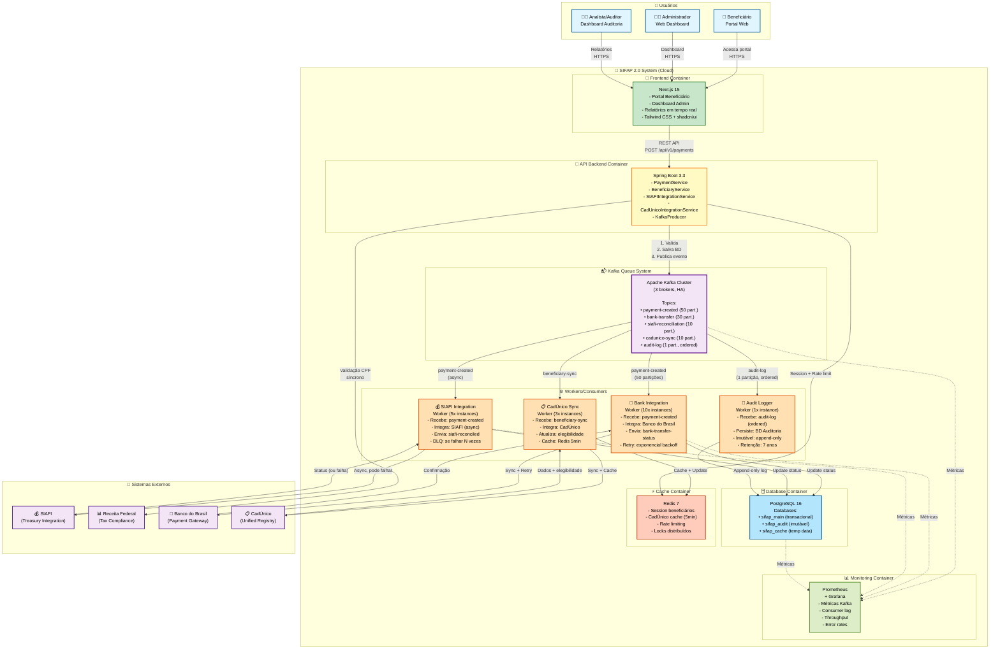

# C4 Level 2 - Diagrama de Containers com Kafka - SIFAP 2.0

> Diagrama de containers mostrando SIFAP 2.0 modernizado com sistema de queue Kafka integrado, incluindo componentes internos, fluxos assíncronos e resiliência.

## Visão Geral

Este diagrama C4 Nível 2 (Container) apresenta a arquitetura interna do SIFAP 2.0 com:

- **4 Containers principais** (API, Frontend, Queue, Workers)
- **Sistema de Message Queue Kafka** (resiliência, auditoria, replay)
- **Banco de dados PostgreSQL** (auditoria imutável, 7 anos)
- **Integração assíncrona** com sistemas externos
- **Processamento paralelo** de pagamentos

## Diagrama C4 Nível 2 com Kafka



---

## Componentes Detalhados

### 1️⃣ Frontend Container - Next.js 15

```yaml 
Responsabilidade: Interface de usuário
Tecnologia: Next.js 15 App Router, TypeScript, Tailwind CSS, shadcn/ui
Hosted: Azure App Service / Container Apps

Features:
  - Portal Beneficiário: Consulta benefícios, visualiza pagamentos
  - Dashboard Admin: Gerenciar beneficiários, ver fila de processamento
  - Dashboard Analista: Relatórios em tempo real, auditoria
  - Responsive Design: Web + mobile-friendly

Comunicação:
  - REST API → Backend (autenticação: Entra ID)
  - WebSocket: Notificações em tempo real (pagamento recebido)
```

### 2️⃣ Backend API Container - Spring Boot

```yaml 
Responsabilidade: Lógica de negócio, orquestração, produtor Kafka
Tecnologia: Java 21, Spring Boot 3.3, JPA/Hibernate
Hosted: Azure Container Apps

Services:
  - PaymentService: Calcular e criar pagamentos
  - BeneficiaryService: CRUD de beneficiários
  - SIAFIIntegrationService: Chamadas síncronas a SIAFI (se urgente)
  - CadUnicoIntegrationService: Consulta elegibilidade
  - KafkaProducer: Publicar eventos para fila

API Endpoints:
  - POST /api/v1/payments → Cria pagamento, publica evento
  - GET /api/v1/beneficiaries/{cpf} → Consulta beneficiário
  - GET /api/v1/payments/{id}/status → Status do pagamento

Padrões:
  - REST API com versionamento (/v1/)
  - JWT/Entra ID para autenticação
  - Validação de entrada com Bean Validation
  - Auditoria automática via AspectJ
```

### 3️⃣ Kafka Queue System - Apache Kafka

```yaml 
Responsabilidade: Message Queue distribuída, Event Store, resiliência
Tecnologia: Apache Kafka 3.6+, 3 brokers (HA), Topic replication=3

Topics e Partições:

1. payment-created (50 partições)
   ├─ Partition key: beneficiaryId (garante ordem por beneficiário)
   ├─ Retenção: 7 dias (compliance)
   ├─ Consumidores: bank-worker, siafi-worker, audit-worker
   └─ Formato: PaymentCreatedEvent (JSON Schema)

2. bank-transfer (30 partições)
   ├─ Partition key: beneficiaryId
   ├─ Conteúdo: Status de transferências do Banco
   └─ Consumer: frontend (via WebSocket, notificações)

3. siafi-reconciliation (10 partições)
   ├─ Partition key: paymentId
   ├─ Conteúdo: Confirmação de SIAFI
   └─ Retenção: 90 dias (finance compliance)

4. cadunico-sync (10 partições)
   ├─ Partition key: beneficiaryId
   ├─ Conteúdo: Sincronização de elegibilidade
   └─ Retenção: 30 dias

5. audit-log (1 partição APENAS)
   ├─ Partition key: NONE (order guaranteed)
   ├─ Retenção: 7 ANOS (legal requirement)
   ├─ Append-only: NENHUMA deleção
   ├─ Compacted: NON (history preservation)
   └─ Consumer: audit-worker (1 instance, ordenado)

Garantias Kafka:
  - Replication factor: 3 (HA)
  - Min ISR: 2 (consistency)
  - Compression: snappy (50% menos storage)
```

### 4️⃣ Workers/Consumers - Múltiplas Instâncias

#### 🏦 Bank Integration Worker (10 instâncias)

```yaml 
Responsabilidade: Integração com Banco do Brasil, processamento paralelo
Tecnologia: Spring Boot Consumer, @KafkaListener

Fluxo:
  1. Consome: payment-created event
  2. Valida: regras de negócio (desconto, valor mínimo)
  3. Chama: Banco do Brasil API (HTTP POST)
  4. Persiste: Resultado no PostgreSQL
  5. Publica: bank-transfer-status event
  6. Retry: exponencial backoff (1s, 2s, 4s, 8s, 16s, 32s)

Resiliência:
  - Circuit breaker: Se Banco indisponível > 5 falhas, para de tentar
  - Timeout: 30 segundos por requisição
  - Retry limit: 6 tentativas (máx 60s total)
  - Dead Letter Queue: Após 6 falhas, vai para DLQ_bank

Paralelismo:
  - 10 instâncias rodam em paralelo
  - Cada uma consome de 50 partições
  - Processamento: ~100 pagamentos/segundo

Monitoramento:
  - Consumer lag: deve estar < 1 minuto
  - Error rate: deve estar < 0.1%
  - Throughput: 1000-5000 msg/sec
```

#### 💰 SIAFI Integration Worker (5 instâncias)

```yaml 
Responsabilidade: Integração RESILIENTE com SIAFI (nosso caso problema!)
Tecnologia: Spring Boot Consumer, @KafkaListener

Fluxo (Assíncrono - PODE FALHAR):
  1. Consome: payment-created event
  2. Tenta: Chamar SIAFI API
  3. Se sucesso: Publica siafi-reconciled event
  4. Se SIAFI down: NÃO FAZ NADA, volta para fila
  5. Se erro validação: Vai para DLQ (humano investiga)

Características Principais:
  - NÃO é bloqueante (diferente do legacy!)
  - Pagamento é processado no Banco INDEPENDENTEMENTE
  - Se SIAFI cai: Mensagem fica na fila, retry automático
  - Quando SIAFI volta: Reprocessa tudo automaticamente
  - ZERO impacto no pagamento do beneficiário ✅

Retry Strategy:
  - Initial backoff: 5 segundos
  - Max backoff: 5 minutos
  - Exponential multiplier: 2x
  - Max retries: 1440 (24 horas)
  - Dead Letter Queue: Após 24h tentando

Exemplo Cenário (SIAFI fora por 1 hora):
  ├─ 22:00 - SIAFI cai
  ├─ 22:00-22:05 - Worker tenta reprocessar, falha
  ├─ 22:05-22:10 - Backoff 5s, retenta
  ├─ 22:10-22:30 - Aumentando backoff (max 5min)
  ├─ 23:00 - SIAFI volta online
  ├─ 23:00-23:01 - Worker processa mensagens acumuladas
  └─ 23:05 - Tudo reconciliado ✅ (ZERO perda de dados)
```

#### 📋 CadÚnico Sync Worker (3 instâncias)

```yaml 
Responsabilidade: Sincronizar elegibilidade com CadÚnico
Tecnologia: Spring Boot Consumer, Redis Cache

Fluxo:
  1. Consome: cadunico-sync event
  2. Chama: CadÚnico API (consulta elegibilidade)
  3. Cache: Resultado no Redis (TTL: 5 minutos)
  4. Persiste: No PostgreSQL (histórico)
  5. Publica: elegibility-checked event

Características:
  - Cache local: 5 minutos (evita chamadas repetidas)
  - Retry: 3 tentativas com backoff
  - Fallback: Se CadÚnico indisponível, usa cache antigo (degradado)
  - Retenção: 30 dias em Kafka

Integração com Pipeline:
  - Antes de processar pagamento: Verifica elegibilidade
  - Se inelegível: Rejeita e notifica beneficiário
  - Se elegível: Segue para Banco
```

#### 📜 Audit Logger Worker (1 instância APENAS)

```yaml 
Responsabilidade: Logging imutável, auditoria, compliance
Tecnologia: Spring Boot Consumer, PostgreSQL

Fluxo (ORDENADO - 1 worker):
  1. Consome: audit-log event (ordem GARANTIDA)
  2. Enriquece: Adiciona timestamp, user context
  3. Persiste: PostgreSQL (append-only)
  4. Salva: Também em cold storage (Azure Blob, S3)
  5. Nunca deleta: Retenção 7 anos OBRIGATÓRIA

Eventos Auditados:
  - Payment created
  - Beneficiary registered / modified / cancelled
  - SIAFI reconciliation
  - Bank transfer initiated / confirmed
  - Discount applied
  - Manual override by operator
  - Report generated
  - User login / logout

Garantias:
  - 1 instância apenas (order preserved)
  - Partition: 1 (não há escalabilidade, por design)
  - Retenção: 7 ANOS (compliance total)
  - Imutável: Nenhuma deleção / update
  - Backup: Daily snapshots em cold storage

Compliance:
  - Atende Lei Geral de Proteção de Dados (LGPD)
  - Atende requisitos de auditoria TCU/CGU
  - Fornece rastreamento completo (beneficiário A → pagamento X → SIAFI Y)
```

### 5️⃣ Database Container - PostgreSQL 16

```yaml 
Responsabilidade: Persistência transacional, histórico, auditoria
Tecnologia: PostgreSQL 16, 3 replicas (HA)

Databases:

1. sifap_main (Transacional, ACID)
   ├─ beneficiaries: CPF, status, family data
   ├─ payments: amount, status, discount, dates
   ├─ benefit_programs: benefit types, rules
   ├─ discount_configuration: types, values, effective dates
   └─ Backup: Daily + WAL archival

2. sifap_audit (Imutável, 7 anos)
   ├─ audit_log: Cada evento do sistema
   ├─ Append-only: INSERT only, NO UPDATE/DELETE
   ├─ Partitioned: Por ano (audit_2026, audit_2027, etc.)
   ├─ Indexes: Rápida busca por CPF, date, event_type
   └─ Retenção: 7 anos conforme LGPD

3. sifap_cache (Temporal, TTL)
   ├─ beneficiary_session: Dados em sessão
   ├─ cadunico_cache: Elegibilidade (5min TTL)
   ├─ payment_locks: Distributed locks
   └─ Auto-clean: Após TTL expirar

Características:
  - Replication factor: 3 (standby em zona diferente)
  - Backup: Incremental diário + full mensal
  - Encryption: Dados em repouso + em trânsito (TLS)
  - Monitoring: Prometheus exporter, alertas
```

### 6️⃣ Cache Container - Redis 7

```yaml 
Responsabilidade: Cache de sessão, CadÚnico, rate limiting
Tecnologia: Redis 7, Cluster mode (HA)

Estrutura:

1. Session Storage
   ├─ key: session:{sessionId}
   ├─ value: user info + permissions
   └─ TTL: 8 horas

2. CadÚnico Cache
   ├─ key: cadunico:{cpf}
   ├─ value: eligibility status + family data
   └─ TTL: 5 minutos

3. Rate Limiting
   ├─ key: ratelimit:{userId}:{endpoint}
   ├─ value: request count
   └─ TTL: 1 minuto
   ├─ Limit: 100 req/min por usuário

4. Distributed Locks
   ├─ key: lock:{beneficiaryId}:payment
   ├─ value: lock owner
   └─ TTL: 30 segundos (anti-deadlock)

Resiliência:
  - Cluster mode: 6 nodes (3 masters + 3 replicas)
  - Failover automático
  - Perda de cache é tolerada (non-critical data)
```

### 7️⃣ Monitoring Container - Prometheus + Grafana

```yaml 
Responsabilidade: Observabilidade, alertas, dashboards
Tecnologia: Prometheus, Grafana, AlertManager

Métricas Críticas:

1. Kafka Metrics
   ├─ Consumer lag por topic
   ├─ Message throughput (msg/sec)
   ├─ Partition rebalancing
   ├─ Broker disk usage
   └─ Alert: Consumer lag > 5 minutos

2. Worker Metrics
   ├─ Processing latency (ms)
   ├─ Error rate (%)
   ├─ Retry count
   ├─ Dead letter queue size
   └─ Alert: Error rate > 1%

3. Database Metrics
   ├─ Query latency (ms)
   ├─ Connection pool usage
   ├─ Replication lag
   ├─ Disk usage
   └─ Alert: Replication lag > 10s

4. Application Metrics
   ├─ HTTP request latency
   ├─ API endpoint error rate
   ├─ Authentication failures
   └─ Alert: API response time > 1s

Dashboards:
  - Real-time payment processing
  - Kafka consumer health
  - System resource usage
  - Business KPIs (payments/day, success rate)
```

---

## Fluxos de Dados Detalhados

### Fluxo 1: Novo Pagamento (Beneficiário requisita)

```js 
1. Beneficiário acessa portal (Frontend Next.js)
   └─ GET /api/v1/beneficiaries/{cpf}/pending-payments

2. Backend Spring Boot recebe requisição
   ├─ Valida autenticação (Entra ID)
   ├─ Valida CPF (modulo-11)
   ├─ Consulta PostgreSQL (dados beneficiário)
   ├─ Valida regras de negócio:
   │  ├─ Status = ACTIVE?
   │  ├─ Desconto total ≤ 30%?
   │  ├─ Valor líquido > 0?
   │  └─ CadÚnico elegível? (cache Redis)
   └─ Salva BD: Payment(status=PENDING)

3. Backend publica evento Kafka
   ├─ Topic: payment-created
   ├─ Key: beneficiaryId (para ordem)
   └─ Value: PaymentCreatedEvent(id, amount, timestamp)

4. Responde ao Frontend
   ├─ HTTP 201 Created
   ├─ Location: /api/v1/payments/{paymentId}
   └─ Status: PENDING

5. Frontend recebe
   └─ Mostra: "Pagamento em processamento..."

6. Bank Worker consome evento
   ├─ 100ms depois de publicado
   ├─ Chama: POST https://api.bancodob.com.br/transfers
   ├─ Status: BANK_TRANSFER_INITIATED
   └─ Publica: bank-transfer event

7. SIAFI Worker consome evento (em paralelo, assíncrono)
   ├─ Tenta: POST https://siafi.fazenda.gov.br/movements
   ├─ Se sucesso: status=SIAFI_RECONCILED
   ├─ Se falha: Volta para fila, retry automático
   └─ Publica: siafi-reconciled (se sucesso)

8. Audit Worker consome evento
   ├─ Persiste: Payment created at 2026-04-29T15:32:45Z
   ├─ User: cpf-123.456.789-10
   ├─ Action: CREATE_PAYMENT
   └─ Retenção: 7 anos

9. Frontend recebe via WebSocket
   ├─ bank-transfer-status: SUCCESS
   ├─ amount: R$ 500.00
   └─ Mostra: "✅ Pagamento processado! Dinheiro chegará em até 2h"

TEMPO TOTAL: 200-500ms (SEM bloquear em SIAFI!)
```

### Fluxo 2: SIAFI Indisponível (Resiliência)

```js 
ANTES (Legacy - PROBLEMA):
├─ Pagamento → Banco ✅
├─ Pagamento → SIAFI ❌ (timeout, fora do ar)
└─ Batch inteiro PARALISA ❌

AGORA (SIFAP 2.0 com Kafka - SOLUÇÃO):
├─ 22:00 - SIAFI cai (banco de dados crash)
├─ 22:00 - Backend publica evento para Kafka
├─ 22:00 - Bank Worker processa (Banco recebe ordem) ✅
├─ 22:00 - SIAFI Worker tenta, falha ⚠️
├─ 22:00 - Worker: "SIAFI unavailable, colocando em retry"
├─ 22:05 - Backoff 5s, worker retenta
├─ 22:07 - Falha novamente, backoff aumenta (10s)
├─ ... (retries continuam a cada 5 min)
├─ 23:00 - SIAFI volta online!
├─ 23:01 - Worker: "SIAFI now available, processing backlog"
├─ 23:02 - Todos os 5k eventos acumulados processados ✅
└─ 23:05 - Dashboard mostra: "SIAFI Reconciliation Complete"

RESULTADO:
├─ Beneficiários RECEBERAM pagamentos (Banco processou) ✅
├─ SIAFI está atualizado com TODOS os movimentos ✅
├─ ZERO dados perdidos ✅
├─ Zero impact no negócio ✅
└─ Auditoria completa de todo o incidente ✅
```

### Fluxo 3: Batch Mensal (5M Beneficiários)

```js 
ANTES (Legacy - 3h20min sequencial):
Domingo 20:00 - Inicia
├─ 02:00 - Calcula 5M pagamentos (sequencial)
├─ 03:00 - Envia para Banco (sequencial)
├─ 04:00 - Tenta SIAFI (bloqueia se falhar!)
└─ 23:00+ - Termina (se tudo correr bem)

AGORA (SIFAP 2.0 - ~30 minutos paralelo):
Domingo 20:00 - Inicia Batch Job
├─ 20:00 - Cria 5M Payment records (PostgreSQL)
├─ 20:01 - Publica 5M eventos para Kafka
│  └─ paymentIds 1-5M → payment-created topic
├─ 20:01 - 10 Bank Workers começam consumir (paralelo)
│  ├─ Worker 1: Processa paymentIds 1-500k
│  ├─ Worker 2: Processa paymentIds 500k-1M
│  ├─ ...
│  └─ Worker 10: Processa paymentIds 4.5M-5M
├─ 20:01 - 5 SIAFI Workers começam consumir (paralelo, async)
│  ├─ Sem bloquear Bank workers
│  └─ Se falhar, retry automático
├─ 20:01 - 3 CadÚnico Workers sincronizam elegibilidade
├─ 20:01 - 1 Audit Worker persiste todos os eventos
│  └─ Append-only, garantindo ordem
│
├─ 20:15 - 2.5M pagamentos no Banco ✅
├─ 20:20 - 5M pagamentos no Kafka (persistidos) ✅
├─ 20:25 - 4.5M pagamentos reconciliados com SIAFI ✅
├─ 20:25 - 0.5M em retry (SIAFI slow, mas eventualmente ok)
├─ 20:30 - BATCH COMPLETO ✅
│  └─ Relatório: 5M pagamentos processados, 0 perdidos
│
└─ 20:35 - Monitoramento:
   ├─ Kafka: 0 eventos não-processados
   ├─ Bank: 100% sucesso
   ├─ SIAFI: 99.9% reconciliado (0.1% em retry, resolverá)
   └─ Auditoria: 5M eventos registrados ✅

COMPARAÇÃO:
├─ Legacy: 3h20min (sequencial, frágil)
└─ Modern: 30min (paralelo, resiliente) = 6.6x mais rápido!
```

---

## Benefícios da Arquitetura com Kafka

### ✅ Resiliência

```js 
❌ Legacy:
  └─ SIAFI cai → Batch inteiro paralisa

✅ Modern:
  └─ SIAFI cai → Pagamentos continuam
     └─ SIAFI reconcilia depois automaticamente
```

### ✅ Escalabilidade

```js 
❌ Legacy:
  └─ 3h20min para 5M registros (limite)

✅ Modern:
  └─ 30min para 5M registros (escalável a 50M)
  └─ Adicione mais workers conforme demanda
```

### ✅ Auditoria Imutável

```js 
❌ Legacy:
  └─ Auditoria em tabelas normais (pode ser deletada)

✅ Modern:
  └─ Kafka + PostgreSQL append-only
  └─ 7 anos de retenção garantida
  └─ ZERO possibilidade de deleção
```

### ✅ Observabilidade

```js 
❌ Legacy:
  └─ Falta visibilidade de erros, retries

✅ Modern:
  └─ Prometheus + Grafana
  └─ Consumer lag monitorado
  └─ Error rates visíveis em tempo real
```

### ✅ Replayability

```js 
❌ Legacy:
  └─ "Reprocessar último mês" = muito difícil/arriscado

✅ Modern:
  └─ Kafka offset seek
  └─ "Reprocessar últimos 7 dias" = 1 comando
  └─ 100% seguro, zero risco
```

---

## Matriz de Tecnologias

| Camada                      | Tecnologia           | Razão                                         | 
|-----------------------------|----------------------|-----------------------------------------------| 
| **Frontend**                | Next.js 15           | Modern web framework, TypeScript, SSR         | 
| **Backend**                 | Spring Boot 3.3      | Java 21, melhor integração com Kafka          | 
| **Queue**                   | Apache Kafka         | Replayability, event sourcing, escalabilidade | 
| **Database**                | PostgreSQL 16        | ACID transactions, audit, open-source         | 
| **Cache**                   | Redis 7              | Performance, distributed locks                | 
| **Monitoring**              | Prometheus + Grafana | Observabilidade em tempo real                 | 
| **Container Orchestration** | Kubernetes (AKS)     | Auto-scaling, resilience                      | 
| **Infrastructure**          | Azure (Bicep IaC)    | Cloud gerenciado, compliance                  | 

---

## Próximos Passos da Arquitetura

### Phase 1: Foundation (Semana 1-2)
- ✅ Backend Spring Boot básico
- ✅ PostgreSQL setup
- ✅ Kafka cluster (dev)

### Phase 2: Integration (Semana 3-4)
- ✅ Kafka producers e consumers
- ✅ Bank integration worker
- ✅ SIAFI resilience worker

### Phase 3: Observability (Semana 4-5)
- ✅ Prometheus metrics
- ✅ Grafana dashboards
- ✅ Alert policies

### Phase 4: Testing &amp; Cutover (Semana 6+)
- ✅ Load testing 10k msg/sec
- ✅ Chaos engineering (simular falhas)
- ✅ Parallel run validation
- ✅ Go-live

---

## Referências
- [Apache Kafka Architecture](https://kafka.apache.org/documentation/#architecture)
- [Spring Kafka Integration](https://spring.io/projects/spring-kafka)
- [C4 Model for Architecture](https://c4model.com/)
- [Event Sourcing Pattern](https://martinfowler.com/eaaDev/EventSourcing.html)
- [Kafka Consumer Group Specification](https://kafka.apache.org/documentation/#consumerconfigs)
- [Queue System Implementation Guide](./queue-system-implementation-guide.md)
- [SIAFI Failure Impact Analysis](./impact-analysis-siafi-failure.md)
